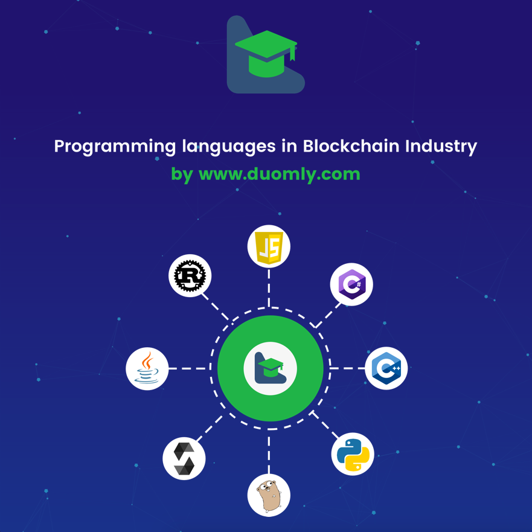
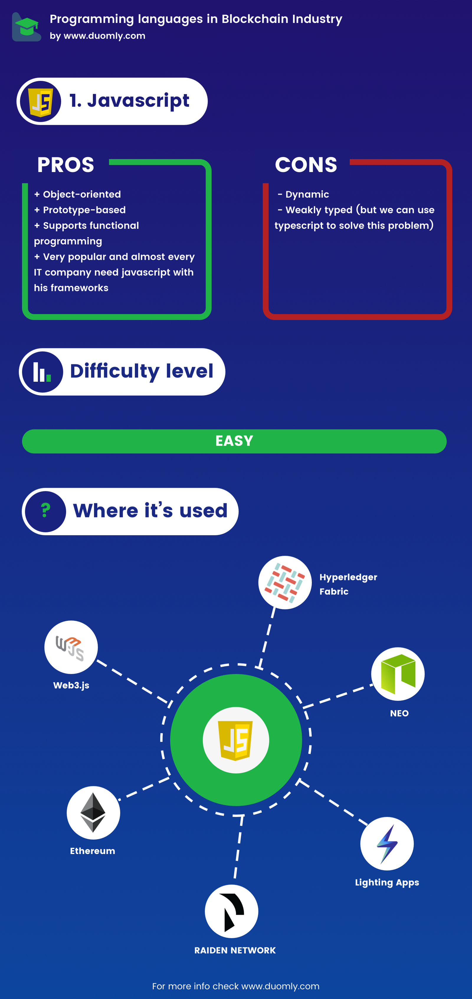
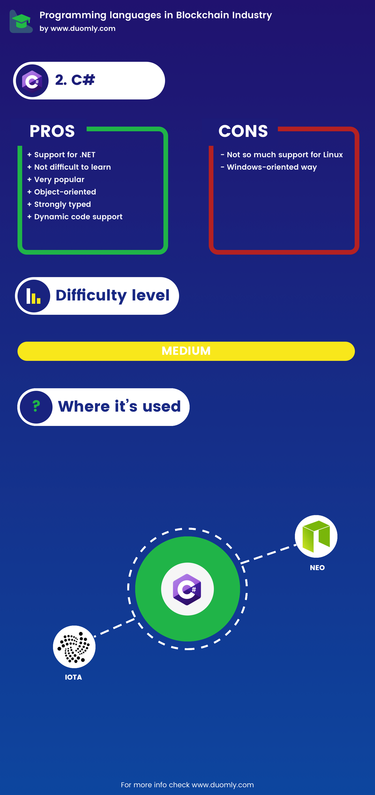
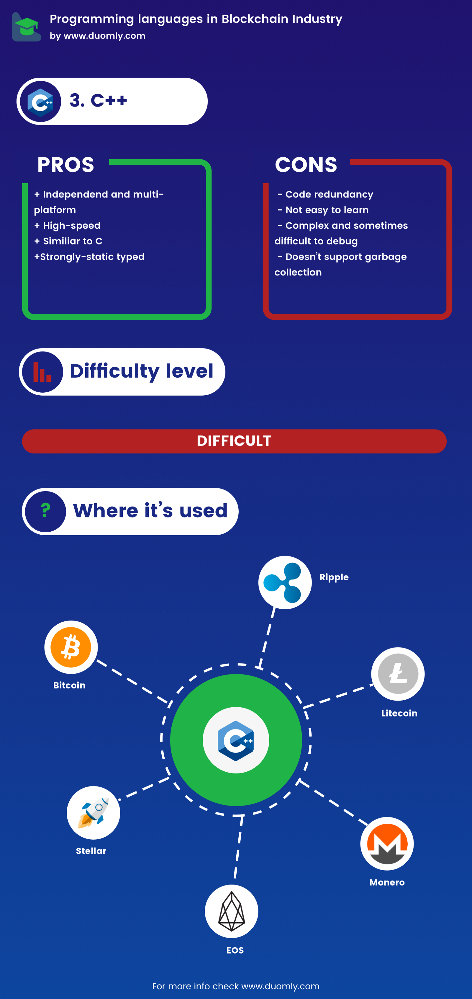
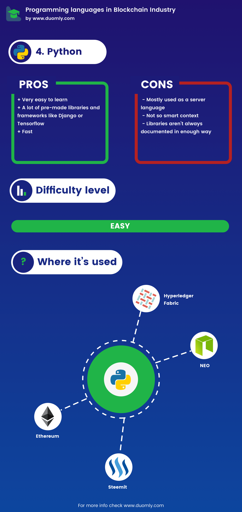
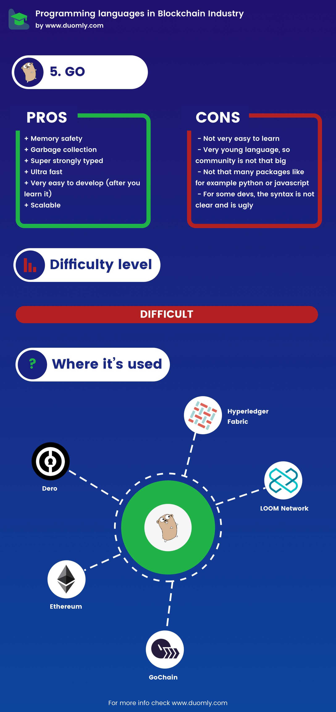
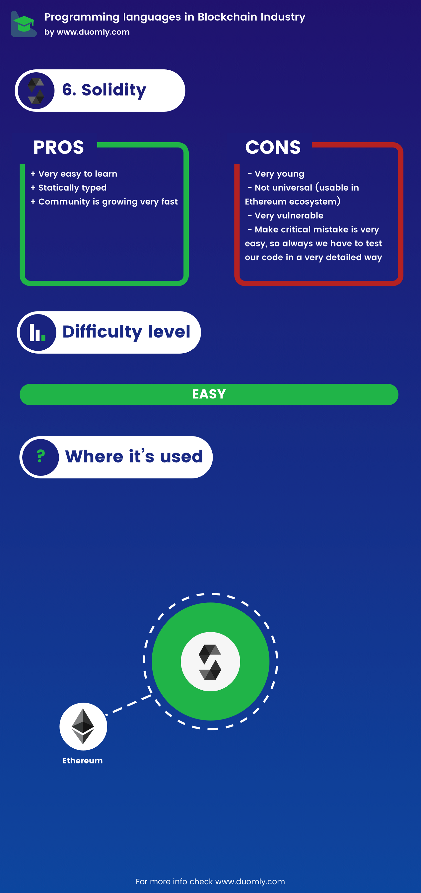
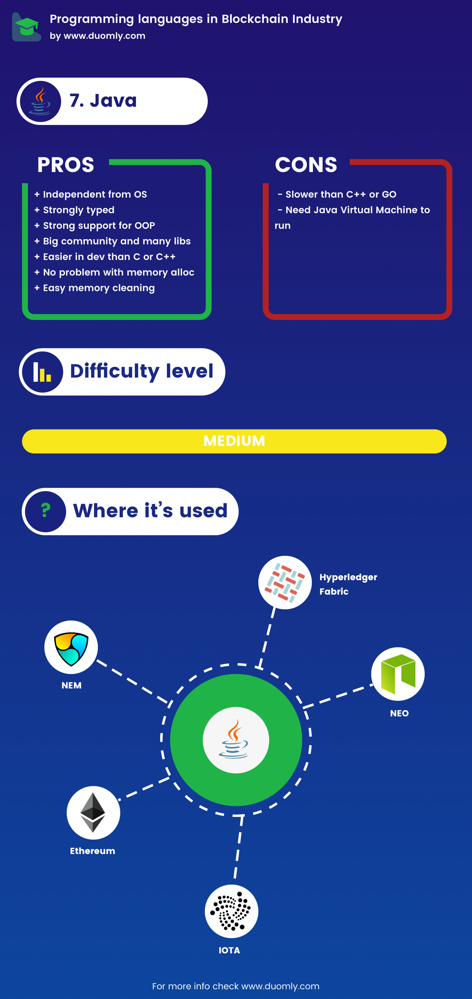
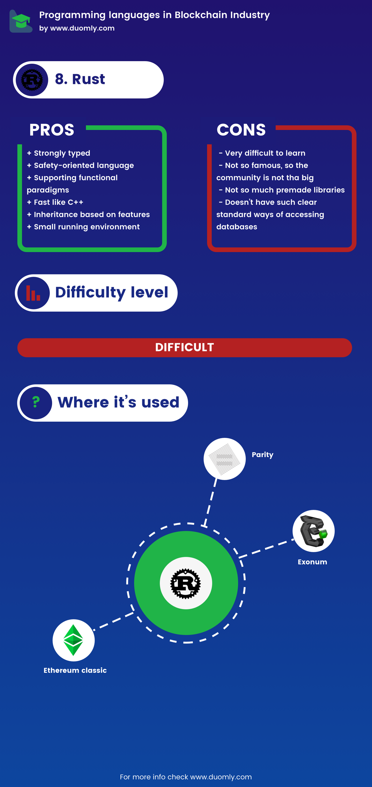

> 原文地址 https://www.blog.duomly.com/which-programming-language-is-the-best-for-blockchain/

Blockchain because is secure, fast and decentralized (not always, but in most cases yes) is technology which is coming to our world, business, life and enterprise really quick.

Thousands of blockchain projects are in development or are developed and deployed to the internet. Companies are looking for new blockchain ideas or trying to improve what other companies created now like crazy, and this is just the beginning of how blockchain technology is running the world.

For us, developers or people who would like to start working in blockchain industry is like a dream. We can find a job immediately with a really high salary and good conditions. However, is one important question.

**Which programming language is the best for blockchain?**

In blockchain development zone we have few most popular languages, they are Javascript, C#, C++, Python, Golang, Solidity, Java, and Rust.

Now I will try to explain you the short description of every language, pros and disadvantages, the difficulty level of go into the language from scratch, and which blockchain project is using that language.

**1.Javascript**
----------------

Javascript is interpreted programming language defined as high-level.

What is most important for us javascript is prototype-based, dynamic and weakly typed and is one of the leading web technologies.

Javascript from a few years is very popular, and many companies are creating new frameworks for javascript like angular/react/vue/node.js which can help us developing code.

#### **Pros**

– Object-oriented

– Prototype-based

– Supports functional programming

– Very popular and almost every IT company need javascript with his frameworks

#### **Disadvantages**

– Dynamic

– Weakly typed (but we can use typescript to solve this problem)

#### **Difficulty level**

Javascript has kind of low entrance difficulty level, and we don’t have to learn javascript really deep to work with it.

To start working with javascript, we need to learn basics and go more deeply later when we need that.

Helpful with javascript learning is the fact, on the internet are many materials with courses and tutorials, not only for pure javascript but for popular frameworks as well.

#### **Where is used in the blockchain**

The most popular place where is used is web3.js and ethereum.js which are helping us connect our frontend of application to connect with ethereum network and smart contracts.

Next popular way where developers use javascript is Hyperledger Fabric SDK for node.js it is huge framework used very often in big companies and corporations so if you like this way of work it could be a good option for you.

One more popular blockchain where you could use javascript to work with contracts is NEO, very fast blockchain which can handle even few thousands of transactions per second.

Less famous but still very often javascript using case are lighting apps, which is super fast network built on top of bitcoin blockchain and the second one which I would like to mention is the Raiden network which is high-speed infrastructure based on top of ethereum blockchain.

**2.C#**
--------

C# is high-level, compiled, objected oriented programming language created in the late 90’s — early 00’s for Microsoft.

It’s very similar language to Java or C++, similar to Java C++ code is a collection of classes and using inheritance.

#### **Pros**

– Support for .NET

– Kind of easy to learn

– Very popular

– Object-oriented

– Strongly typed

– Dynamic code support

#### **Disadvantages**

– Not so much support for Linux

– Windows oriented way

#### **Difficulty level**

For me, it was more difficult language to learn than javascript because syntax and the types, but is not that difficult and complicated language like for example Go.

Additionally, tons of good and free learning sources are making this language one of the easiest to learn.

#### **Where is used**

C# is used in a few popular blockchain projects, one of the most popular is NEO which is named Chinese version of Ethereum.

Neo is a high-speed Blockchain platform, which can handle even few thousands of transactions per second.

Next popular project where we use C# is IOTA, which is highly scalable and zero-fee transactions tangle type project which is oriented on the Internet of Things.

**3.C++**
---------

C++ is strongly static typed, high-speed, object-oriented, compiled language.

Essential is fact C++ has high-level efficiency and access to hardware.

What is interesting C++ was created in 70–80’s an extension to C.

#### **Pros**

– Independent and multiplatform

– High-speed

– Similiar to C

– Strongly static types

#### **Disadvantages**

-Code redundancy

-Not so easy to learn

-Complex and sometimes difficult to debug

-Doesn’t support garbage collection

#### **Difficulty level**

C++ because its more complicated is more challenging to learn than C, when C is at least medium / hard to learn.

It’s definitely not an easy language for beginners.

#### **Where is used**

C++ is used in a lot of popular blockchain cryptocurrencies and important blockchain projects like:

– Bitcoin (most famous cryptocurrency)

– Ripple (centralized ultra fast currency)

– Bitcoin cash (cryptocurrency)

– Litecoin (cryptocurrency)

– Monero (cryptocurrency)

– Eos (fast blockchain network with own cryptocurrency named EOS)

– Stellar (payment network, one of the founders is the creator of eDonkey)

– QTUM (kind of hybrid between ethereum and bitcoin)

– Cpp-ethereum (C++ implementation of ethereum)

**4.Python**
------------

Trendy high-level, dynamically typed programming language.

Python supports object-oriented and functional programming.

This language is coming more popular than it was before. Python is the excellent language to develop machine learning and artificial intelligence features.

IT giants support Python by creating smart tools and frameworks like dialogflow or tensorflow.

Python is one of the most often selecting languages for creating chatbots.

#### **Pros**

– Very easy to learn

– A lot of premade libraries and frameworks like Django or Tensorflow

– Fast

#### **Disadvantages**

– Mostly used as a server language

– Not so smart context

– Libraries aren’t always documented in enough way

#### **Difficulty level**

Python is very popular and very often selected as a first programming language.

The Internet contains the massive amount of tutorials and courses, what is making Python one of the easiest programming languages to learn.

#### **Where is used**

In blockchain industry Python is used in many good projects, for example, has own implementation of Ethereum(pyethereum), we can use it to create contracts for NEO and smartcontracts for Hyperledger as well.

One more thing what about I would like to mention is steempython. It’s pythons implementation for steemit, trendy kind of social media — content providing ecosystem.

**5.Golang**
------------

Go is statically typed, compiled programming language created by Google employees.

The first idea was, Go should contain a mix of easy developing code like Python and the efficiency of compiled languages like C++.

#### **Pros**

– Memory safety

– Garbage collection

– Super strongly typed

– Ultra fast

– Very easy to develop, after you learn it

– Scalable

#### **Disadvantages**

– Not very easy to learn

– Very young language, so the community is not that big

– Not that many packages like for example python or javascript

– For some devs, the syntax is not clear and ugly

#### **Difficulty level**

Go doesn’t have that many good tutorials on the internet like javascript which can attack you from every place and people have to look more deeply to find something, and is complicated language, so Go has the opinion of very difficult to learn.

However, this opinion is sent very often from people who are python/javascript developers, because go is different from these languages very much.

Anyway if you’re coming from C++ or Java, learning Go should be very easy for you.

#### **Where is used**

We could talk about Golang related projects without end, but I will try to describe the most popular ones.

One of the most important projects for GO is Go-Ethereum which is written in golang.

Next important project which is written in Go is Hyperledger Fabric, one of the most popular blockchain solutions for big companies.

Exciting project targeting decentralized online games Loom Network has written chain in Go as well. The less popular project which uses blockchains is Btcd, its bitcoing implementation written in Go, next is Gochain, fast ethereum compatible blockchain written in Go.

Moreover, the last one written in Golang project which I would like to mention is fast, targeting privacy of smart contracts blockchain named Dero.

**6.Solidity**
--------------

Contract-oriented statically typed language created by Ethereum developers.

Created for EVM, as smart-contract development main language and is the primary language for Ethereum’s smart contracts.

#### **Pros**

– Statically typed

– Very easy to learn

– Popularity is growing very fast

#### **Disadvantages**

– Very young

– The community is not big yet, so support is smaller

– Not universal (usable in Ethereum ecosystem)

– Very vulnerable

– Make critical mistake is very easy, so always we have to test our code in a very detailed way

#### **Difficulty level**

Solidity is not a complicated language and is a bit like much smaller javascript copy with a few changes like types(we use types in typescript which is used very often in javascript’s projects).

So middle experienced javascript developer can learn solidity in a few days, especially when we have a lot of interactive tutorials like duomly.com.

#### **Where is used**

We will use the solidity language to develop Ethereum smartcontracts.

I didn’t see other projects which uses solidity, but Ethereum development ecosystem is enormous and is one of the most significant parts of blockchain development now, so solidity is one of the most popular languages used in blockchain industry.

**7.Java**
----------

Java is compiled, strongly typed object and class-based programming language created by Sun Microsystems.

Java is very much oriented for object programming and is very popular in big companies.

#### **Pros**

– Independent from the operational system

– Strongly typed

– Strong support for Object-Oriented Programming

– Big community and libraries collection

– Easier in development than languages like C or C++

– No problem with allocation of memory

– Easy memory cleaning

#### **Disadvantages**

– Need Java Virtual Machine to run

– Slower than C++ or Go

#### **Difficulty level**

We can compare the difficulty level to C#, which could be more difficult than javascript or python, is more complicated, but is a very popular language and are tons of learning resources.

Still can plainly tell, Java is easier than Golang or C++.

#### **Where is used**

Java is very popular in blockchain industry, from more popular is used in IOTA (I described what is IOTA in C# step). Popular P2P cryptocurrency and platform named NEM are using Java as well (NEM is written in Java).

Rest of popular projects where we can use Java are:

– Neo’s contracts

– Hyperledger’s contracts

– IBM blockchain

– BitcoinJ (bitcoin’s implementation in Java)

– Ethereum

**8.Rust**
----------

System, compiled, strongly typed programming language, from 2009 Mozilla is taking care about development and sponsoring Rust.

Rust’s syntax is similar to C++.

#### **Pros**

– Strongly typed

– Safety oriented language

– Supporting functional paradigms

– Fast like C++

– Inheritance based on features

– Small running environment

#### **Disadvantages**

– Very difficult to learn

– Not so famous, so the community is not that big, like for example javascript, access to libraries is smaller, and developers have to rewrite many problems from scratch

– Doesn’t have such clear standard ways of accessing databases

#### **Difficulty level**

Rust’s syntax is similar to C++, so this programming language is definitely not easy to learn.

Additionally, the community is much smaller so I would tell the entrance level is high, and I can qualify difficulty as hard.

#### **Where is used**

Few really popular blockchain projects are using Rust.

One of them is Parity, a very fast and secure ethereum client which is written in Rust.

Next one and probably the most popular is Ethereum Classic, and it’s cryptocurrency which born after big hack on Ethereum.

The last one is written in Rust Exonum, Exonum is blockchain security-oriented framework which can handle even few thousands of transactions per second.

**Summary (Winners)**
---------------------

**The biggest amount of job offers in blockchain industry**

1. Blockchain Javascript — 565 job offers

2. Blockchain Solidity — 424 job offers

3. Blockchain Python — 394 job offers

4. Blockchain Go — 361 job offers

5. Blockchain C# — 301 job offers

6. Blockchain C++ — 301 job offers

7. Blockchain Java — 289 job offers

8. Blockchain Rust — 54 job offers

**Winner: Javascript**

#### **The best-paid job offers**

To get best-paid job offers we took range higher than $150k per year, and we will order by the number of job offers with that technology.

Results are below.

1. Blockchain Javascript — 89 job offers

2. Blockchain Go — 81 job offers

3. Blockchain Solidity — 77 job offers

4. Blockchain Python: 71 job offers

5. Blockchain C# — 61 job offers

6. Blockchain C++ — 61 job offers

7. Blockchain Java — 52 job offers

8. Blockchain Rust — 14 job offer

**Winner: Javascript**

#### **Easy to learn**

Of course, learning is an individual thing, but programming languages are more or less complicated, have more or less learning sources on the internet, so I decided to base on my personal experience and internet statistics.

After research in statistics of the difficulty of programming languages and base on my exp I Can order them as below:

1. Solidity

2. Python

3. Javascript

4. Java / C#

5. C++

6. Go

7. Rust

**Winner: Solidity**

#### **General**

After checking all the points, we can type general winner.

Because Javascript is used every time in the frontend of apps, not rarely on backend and middleware has the most significant amount of job offers generally and have the most significant amount of well-paid job offers as well.

Is not so tricky for learning and in combination with solidity is a great combo. For sure, until dApps won’t lose popularity.

**Winner: Javascript and solidity.**

However, if you will check my rankings all of the languages have a lot of job offers and many jobs offers with excellent salary.

So for us differences in the number of job offers and difficulty are that small, so we can tell you, with everyone from these languages you can find an excellent job, quickly.