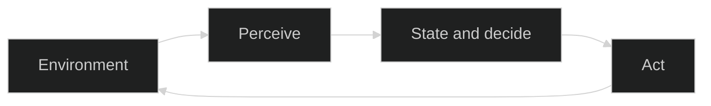

The first two lessons answered two practical questions:

- [Chat, Workflow, or Agent?](/posts/chat-workflow-agent-guide/): who decides the next step?
- [Agents Come in Different Shapes](/posts/agent-patterns-with-pi/): how much runtime decision-making does the model own?

Keep reading and more labels quickly appear: Reflex Agent, Goal-based Agent, BDI, Reactive Architecture, LLM Agent, and Multi-Agent.

The common mistake is to arrange them as an upgrade path:

```text
Reactive → BDI → LLM Agent → Multi-Agent
```

That line mixes answers to different questions. It is like ranking front-wheel drive, electric cars, automatic transmission, and a fleet on one scale.

If you remember only one idea from this lesson, make it this one:

> **Agent classifications are not one tree. They are several coordinates that can describe the same system at the same time.**

## Every agent starts with the same loop

Whether it is a robot vacuum, a trading program, or an LLM agent with tools, the basic shape is the same:



The agent receives information from its environment, selects an action using its state and goals, then changes the environment through that action.

*Artificial Intelligence: A Modern Approach* (AIMA) describes an agent function as a mapping from percept history to action. It also introduces the **rational agent**: an agent that selects the action expected to best serve its objective with the information currently available.

Rational does not mean all-knowing or always correct. An agent can fail because evidence is missing and still have made a reasonable choice from what it knew.

This loop is the shared foundation for every classification below.

## Axis 1: what makes it choose an action?

AIMA commonly uses five teaching models to explain the basis of action:

| Type | Plain-language meaning | What it needs |
|---|---|---|
| Simple Reflex | See a condition and apply a rule | Current percept |
| Model-based | Track an internal view of the world | Internal state |
| Goal-based | Compare actions by progress toward a goal | Goals and search |
| Utility-based | Choose the most valuable acceptable outcome | Utility or preferences |
| Learning | Change future behavior from feedback | Feedback and an update mechanism |

These are not five product versions or mandatory maturity levels.

One technical research agent can be all of the following:

- Goal-based because it must answer a research question.
- Utility-based because it balances freshness, credibility, and cost when choosing sources.
- Learning because evaluation feedback may change its later search strategy.

Another useful distinction: using a pretrained model does not automatically make the system a Learning Agent. Learning here means that runtime feedback changes future behavior, not merely that a trained model exists inside the program.

## Axis 2: how is internal control organized?

Classical agent literature also classifies systems by their control architecture.

### Reactive: respond to the current situation

A Reactive Architecture keeps the path from current perception to action short. It has little state and responds quickly, which works well for emergency avoidance or clear local rules, but it is weak at long-horizon planning.

Rodney Brooks's 1991 paper *Intelligence without representation* presented the influential subsumption approach: complex behavior can emerge from prioritized layers of simpler behavior, where an urgent lower-level behavior can temporarily override a higher one instead of relying on one large central world model.

Two similar labels need a direct comparison. Simple Reflex answers “what makes it choose this action?” Reactive Architecture answers “how is the whole control process organized?” They often appear together, but they belong to different coordinates.

### Deliberative: model first, then plan

A Deliberative Architecture explicitly represents the world, goals, or plans before deciding what to do. It can handle longer tasks, but pays the cost of state maintenance, search, and planning.

### Hybrid: react when speed matters, deliberate when thought matters

A Hybrid Architecture combines the two. Lower layers handle urgent reactions while higher layers manage goals, plans, and long-term constraints.

Many production LLM agents are hybrid systems:

```text
Deterministic code: authorization, budgets, timeouts, approval, writes
LLM decisions:       decompose the problem, choose tools, adapt the search path
```

Hybrid does not mean “use several models.” It describes how control responsibilities are layered.

## BDI is more than three prompt fields

BDI organizes decisions around three mental-state concepts:

```text
Belief      What I currently think the world is like
Desire      Goals I may want to achieve
Intention   Work I have committed to continue
```

For a research agent, that might look like this:

- Belief: the official documentation supports claim A, but the version is unclear.
- Desire: verify the version, finish the report, and control tool cost.
- Intention: inspect the changelog before deciding whether claim A stays.

The important word in Intention is **commitment**. It prevents the agent from abandoning its direction every time a new clue appears.

BDI usually sits on the deliberative side, while a real system may wrap it with reactive rules and become hybrid. Adding `beliefs`, `desires`, and `intentions` headings to a prompt is not enough. The system must define when those states change, how conflicts are resolved, and when a commitment should be dropped.

## Axis 3: what is the main decision mechanism?

The LLM era adds another implementation axis: which part performs the main judgment—fixed rules, search algorithms, an LLM, or a mixture? A Planner is a component that produces plans; its own implementation may use rules, algorithms, or an LLM.

An LLM can:

- understand unstructured input;
- create or revise a plan;
- select tools and arguments;
- decide what to do after seeing a tool result;
- turn the process into an answer people can read.

But one LLM call is not automatically an LLM Agent. The system still needs environmental input, actions it can take, and a control process that keeps observing results.

ReAct is a common modern pattern that alternates reasoning and acting. Its name looks similar to **Reactive Architecture**, but the concepts come from different traditions:

```text
ReAct              An LLM runtime pattern: Reasoning + Acting
Reactive Agent     A classical architecture where perception quickly triggers action
```

## Axis 4: how many agents are in the system?

Multi-Agent does not explain how one agent thinks. It describes how several independently acting agents communicate, divide work, and coordinate.

Common topologies include:

- Single Agent: one agent owns the objective and loop.
- Supervisor–Workers: a supervisor delegates work to several workers.
- Peer: relatively equal agents exchange results.
- Hierarchical: coordination and aggregation happen across several levels.

Multi-Agent is not automatically smarter. It may add parallelism and specialization, but it also adds communication, state synchronization, conflict resolution, cost, and evaluation work.

Likewise, several prompts, several model calls, or a fixed Planner → Executor pipeline do not automatically form a multi-agent system. First ask whether the units have relatively independent state, goals, actions, and a coordination process.

## Locate any agent with four fields

First, describe the final project without code: **goal + source trade-offs / hybrid control / LLM and code making decisions together / one agent**.

The following TypeScript type is a teaching aid for this course, not an industry standard. `mentalModel` is an optional part of `control` because BDI and a Hybrid Architecture may describe the same system; they should not be mutually exclusive values:

```ts
type ActionBasis =
  | "reflex"
  | "model-based"
  | "goal-based"
  | "utility-based"
  | "learning";

type ControlArchitecture =
  | "reactive"
  | "deliberative"
  | "hybrid";

interface ControlDesign {
  architecture: ControlArchitecture;
  mentalModel?: "bdi";
}

type DecisionMechanism =
  | "rules"
  | "algorithms"
  | "llm"
  | "mixed";

type TeamTopology =
  | "single"
  | "supervisor-workers"
  | "peer"
  | "hierarchical";

interface AgentArchitectureCard {
  actionBasis: ActionBasis[];
  control: ControlDesign;
  mechanism: DecisionMechanism;
  topology: TeamTopology;
}
```

The first version of our final project, an evidence-first technical research agent, maps like this:

```ts
const researchAgent: AgentArchitectureCard = {
  actionBasis: ["goal-based", "utility-based"],
  control: { architecture: "hybrid" },
  mechanism: "mixed",
  topology: "single",
};
```

It works toward a research question, balances source quality against cost, lets the LLM explore, and keeps authorization, budgets, and evaluation in deterministic code. Version one stays Single Agent so we do not introduce coordination cost before it pays for itself.

Where does Pi fit? A **harness** is the engineering foundation that hosts model calls, the Agent Loop, tool execution, state, and runtime boundaries. Pi determines **how the agent runs**, not **what kind of agent it is**. In the earlier car analogy, Pi is closer to the chassis and test rig than the drive type or fleet structure. The same Pi runtime can host different tools, control boundaries, and team structures.

## Put the map back in the right orientation

When you meet a new agent system, do not begin with “which single agent type is this?” Ask four questions instead:

1. What makes it choose an action?
2. How is its internal control organized?
3. Do rules, algorithms, or an LLM perform the main reasoning?
4. How many independent agents exist, and how do they coordinate?

It is normal for one system to occupy all four coordinates at once. That is not a classification conflict.

The next stage moves into the LLM runtime. We will break down one model call, then add messages, context, streaming, state, and stopping conditions. Once those mechanics are clear, we can implement ReAct, Plan-and-Execute, Reflection, and Multi-Agent systems without memorizing architecture names in isolation.

## References

- Russell & Norvig, [Artificial Intelligence: A Modern Approach](https://aima.cs.berkeley.edu/), Chapter 2: agents, rationality, and action-basis models.
- Wooldridge & Jennings, [Intelligent Agents: Theory and Practice](https://doi.org/10.1017/S0269888900008122): classical agent theory, architectures, and languages.
- Brooks, [Intelligence without representation](https://doi.org/10.1016/0004-3702(91)90053-M): reactive systems and the subsumption approach.
- Rao & Georgeff, [BDI Agents: From Theory to Practice](https://cdn.aaai.org/ICMAS/1995/ICMAS95-042.pdf): Belief, Desire, Intention, and commitment.
- Wooldridge, [An Introduction to MultiAgent Systems](https://www.cs.ox.ac.uk/people/michael.wooldridge/pubs/imas/IMAS2e.html): interaction and coordination in multi-agent systems.
- Yao et al., [ReAct: Synergizing Reasoning and Acting in Language Models](https://openreview.net/forum?id=WE_vluYUL-X): alternating reasoning and acting with LLMs.
- Anthropic, [Building Effective Agents](https://www.anthropic.com/engineering/building-effective-agents): workflows, agents, and modern engineering patterns.

The four-axis card, examples, and relationship diagrams in this lesson are original teaching summaries, not translations or reproductions of figures from the cited sources.
