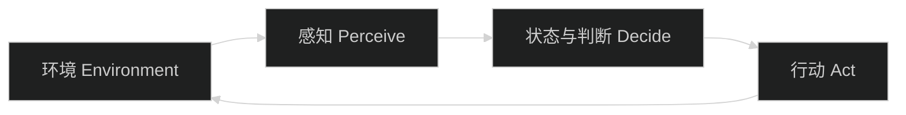

前两篇文章分别回答了两个问题：

- [Chat、Workflow 还是 Agent？](/posts/chat-workflow-agent-guide/)：谁决定下一步？
- [Agent 不只一种](/posts/agent-patterns-with-pi/)：模型拿到了多少运行时决策权？

继续查资料时，你很快会遇到更多名词：Reflex Agent、Goal-based Agent、BDI、Reactive Architecture、LLM Agent、Multi-Agent。

最容易犯的错误，是把它们排成一条升级路线：

```text
Reactive → BDI → LLM Agent → Multi-Agent
```

这条线看起来直观，实际上混合了不同问题。它就像把“前轮驱动”“电动车”“自动挡”和“车队”排成汽车等级，彼此根本不在同一个维度。

如果只记住一句话，请记住：

> **Agent 分类不是一棵树，而是几组可以同时使用的坐标。**

## 所有 Agent 都先有同一个骨架

无论是扫地机器人、交易程序，还是会调用工具的 LLM Agent，都可以先压缩成一个闭环：



Agent 从环境得到信息，根据已有状态和目标选择行动，行动再改变环境。

[《Artificial Intelligence: A Modern Approach》](https://aima.cs.berkeley.edu/)（AIMA；配套开源实现：[aimacode/aima-python](https://github.com/aimacode/aima-python)）把 Agent Function 写成“感知历史到行动的映射”。书里还强调 **Rational Agent**：它会根据目前能拿到的信息，选择预期最有利于目标的行动。

“理性”不代表全知全能，也不代表结果永远正确。一个 Agent 可能因为信息不足而失败，但只要它在现有证据下作出了合理选择，仍然可以是 rational 的。

这套骨架是后面所有分类的共同底座。

## 坐标一：它凭什么选择行动

AIMA 常用五种教学模型解释行动依据：

| 类型 | 大白话理解 | 需要什么 |
|---|---|---|
| Simple Reflex | 看到情况，直接按当前规则行动 | 当前感知 |
| Model-based | 不只看现在，还维护一个世界状态 | 内部状态 |
| Goal-based | 比较行动是否更接近目标 | 目标与搜索 |
| Utility-based | 多个可行结果中选择更划算的一个 | 效用或偏好 |
| Learning | 根据反馈改变后续表现 | 反馈与更新机制 |

这不是五个产品版本，也不是必须依次升级的成熟度等级。

一个技术研究 Agent 可以同时是：

- Goal-based：目标是回答研究问题；
- Utility-based：在时效、可信度和成本之间选择来源；
- Learning：根据评估结果调整后续检索策略。

还有一个常见误会：使用预训练模型，不自动等于 Learning Agent。这里的 learning 指系统会根据运行反馈改变后续行为，而不是“内部放了一个曾经训练过的模型”。

## 坐标二：内部判断过程怎么组织

经典 Agent 文献还会按内部控制结构分类。

### Reactive：先对现场作反应

Reactive Architecture 尽量让当前感知直接触发行为。它状态少、响应快，适合紧急避障或规则明确的局部反应，但不擅长长距离规划。

Rodney Brooks 在 1991 年的论文 *Intelligence without representation* 中提出了具有代表性的 subsumption 思路：复杂行为不一定要依赖一个庞大的中央世界模型，也可以让多层简单行为按优先级组合，紧急的低层行为能够暂时覆盖高层行为。

这里还要直接分清两个相似说法：Simple Reflex 回答“它凭什么选择这个动作”，Reactive Architecture 回答“整个控制过程怎么组织”。两者经常同时出现，但不在同一条坐标上。

### Deliberative：先维护模型，再规划

Deliberative Architecture 会显式表示世界、目标或计划，再推演应该采取什么行动。它能处理更长的任务，但需要付出状态维护、搜索和规划成本。

### Hybrid：该快的时候快，该想的时候想

Hybrid Architecture 把两者组合起来：底层快速处理紧急反应，上层处理目标、计划和长期约束。

生产中的 LLM Agent 经常也是 hybrid：

```text
确定性代码：鉴权、预算、超时、审批、写库
LLM 决策：拆解问题、选择工具、调整检索路径
```

不要把 Hybrid 理解成“同时调用多个模型”。它描述的是控制结构如何分层。

## BDI：不是三个 Prompt 字段

BDI 使用三类“心智状态”组织 Agent 的判断：

```text
Belief      我目前认为世界是什么样
Desire      我可能想完成哪些目标
Intention   我已经承诺继续推进什么
```

例如，一个研究 Agent 可能有：

- Belief：官方文档支持结论 A，但缺少版本信息；
- Desire：找到版本证据、完成报告、控制调用成本；
- Intention：先核对 changelog，再决定是否保留结论 A。

Intention 的关键是“已经承诺”。它能防止 Agent 每看到一个新线索就完全换方向。

BDI 通常位于 deliberative 一侧，真实系统也可以在外层增加 reactive 规则，形成 hybrid。它不是简单地在 Prompt 中增加 `beliefs`、`desires`、`intentions` 三个标题；还需要定义这些状态什么时候更新、冲突时如何选择、什么情况下放弃承诺。

## 坐标三：主要决策机制是什么

到了 LLM 时代，我们又多了一条实现机制坐标：固定规则、搜索算法和 LLM，谁在承担主要判断？Planner 是负责产出计划的组件，它本身也可以由规则、算法或 LLM 实现。

LLM 可以负责：

- 理解非结构化输入；
- 生成或修改计划；
- 选择工具与参数；
- 根据工具结果决定下一步；
- 把过程整理成人能读懂的答案。

但“调用了一次 LLM”不等于 LLM Agent。它仍然需要环境输入、行动能力，以及能持续观察结果的控制过程。

ReAct 是现代 LLM Agent 的常见模式：让 reasoning 与 acting 交替发生。它和经典 **Reactive Architecture** 只是英文外观接近，来源和含义不同：

```text
ReAct              Reasoning + Acting 的 LLM 运行模式
Reactive Agent     当前感知快速触发行为的经典控制架构
```

## 坐标四：系统里有几个 Agent

Multi-Agent 回答的不是“单个 Agent 怎么思考”，而是：系统里有几个能独立选择行动的 Agent，它们如何通信、分工和协调？

常见拓扑包括：

- Single Agent：一个 Agent 持有目标并完成循环；
- Supervisor–Workers：监督者拆任务，多个 Worker 执行；
- Peer：多个相对平等的 Agent 交换结果；
- Hierarchical：多层管理和汇总。

Multi-Agent 不自动更聪明。它增加了并行和专业分工，也增加了通信、状态同步、冲突解决、成本和验收难度。

同样，多个 Prompt、多个模型调用或 Planner → Executor 的固定流水线，也不自动等于 Multi-Agent。至少要确认这些单元是否拥有相对独立的状态、目标、行动能力和协调过程。

## 用四个字段给任意 Agent 定位

先用自然语言给最终项目定位：**目标 + 来源权衡 / 混合控制 / LLM 与代码共同决策 / 单 Agent**。

下面这个 TypeScript 类型不是行业标准，而是我们后续课程使用的教学坐标卡。`control` 里的 `mentalModel` 是可选子字段，因为 BDI 可以和 Hybrid 同时存在，不应该被写成互斥选项：

```ts
type ActionBasis =
  | "reflex"
  | "model-based"
  | "goal-based"
  | "utility-based"
  | "learning";

type ControlArchitecture =
  | "reactive"
  | "deliberative"
  | "hybrid";

interface ControlDesign {
  architecture: ControlArchitecture;
  mentalModel?: "bdi";
}

type DecisionMechanism =
  | "rules"
  | "algorithms"
  | "llm"
  | "mixed";

type TeamTopology =
  | "single"
  | "supervisor-workers"
  | "peer"
  | "hierarchical";

interface AgentArchitectureCard {
  actionBasis: ActionBasis[];
  control: ControlDesign;
  mechanism: DecisionMechanism;
  topology: TeamTopology;
}
```

我们的最终项目“证据优先的技术研究 Agent”第一版会这样定位：

```ts
const researchAgent: AgentArchitectureCard = {
  actionBasis: ["goal-based", "utility-based"],
  control: { architecture: "hybrid" },
  mechanism: "mixed",
  topology: "single",
};
```

它以完成研究问题为目标；根据来源质量和成本作选择；让 LLM 负责探索，让确定性代码负责权限、预算和验收；第一版先使用 Single Agent，避免过早引入协调成本。

Pi 在这里是什么？Harness 是承载模型调用、Agent Loop、Tool 执行、状态和运行边界的工程底座。Pi 决定 Agent **怎么跑**，不决定它**是哪类 Agent**；用前面的汽车类比，Pi 更像底盘和测试台，不是驱动方式，也不是车队组织。同一个 Pi Runtime 可以承载不同的工具、控制边界和组织方式。

## 最后，把地图放正

以后再看到一个 Agent 系统，不要先问“它属于哪一种 Agent”，而是连续问四个问题：

1. 它凭什么选择行动？
2. 内部判断过程怎么组织？
3. 规则、算法和 LLM，谁承担主要决策？
4. 系统里有几个独立 Agent，它们怎么协作？

一个系统同时落在四条坐标上，是正常现象，不是分类冲突。

下一阶段会进入 LLM Runtime：先拆开一次模型调用，再逐步加入 Message、Context、流式输出、状态和停止条件。等底层机制清楚后，我们再实现 ReAct、Plan-and-Execute、Reflection 和 Multi-Agent，避免只记住架构名却不知道它们在代码里改变了什么。

## 参考资料

- Russell & Norvig, [Artificial Intelligence: A Modern Approach](https://aima.cs.berkeley.edu/), Chapter 2：Agent、rationality 与行动依据分类。
- Wooldridge & Jennings, [Intelligent Agents: Theory and Practice](https://doi.org/10.1017/S0269888900008122)：经典 Agent 理论、架构和语言。
- Brooks, [Intelligence without representation](https://doi.org/10.1016/0004-3702(91)90053-M)：Reactive 与 subsumption 思路。
- Rao & Georgeff, [BDI Agents: From Theory to Practice](https://cdn.aaai.org/ICMAS/1995/ICMAS95-042.pdf)：Belief、Desire、Intention 与承诺机制。
- Wooldridge, [An Introduction to MultiAgent Systems](https://www.cs.ox.ac.uk/people/michael.wooldridge/pubs/imas/IMAS2e.html)：Multi-Agent 的交互与协调。
- Yao et al., [ReAct: Synergizing Reasoning and Acting in Language Models](https://openreview.net/forum?id=WE_vluYUL-X)：LLM 中 reasoning 与 acting 的交替模式。
- Anthropic, [Building Effective Agents](https://www.anthropic.com/engineering/building-effective-agents)：Workflow、Agent 与现代工程模式。

本文中的四坐标卡、示例和关系图均为教学整理，不是对上述来源图表的翻译或复刻。
